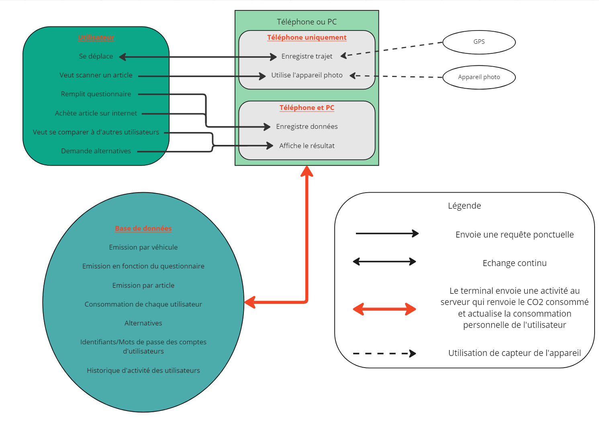

=== Schéma d’architecture

==== Description des blocs

===== Utilisateur

L'ensemble des actions analysées de l'utilisateur ou ses requêtes

===== Téléphone ou PC

Toutes les fonctionnalités de CareBon seront disponibles sur le téléphone mais certaines seront limités sur l'ordinateur, qui n'est pas aussi transportable que le téléphone.

===== Base de données

Nous auront un serveur qui regroupera plusieurs bases de données et qui gardera les données des utilisateurs.