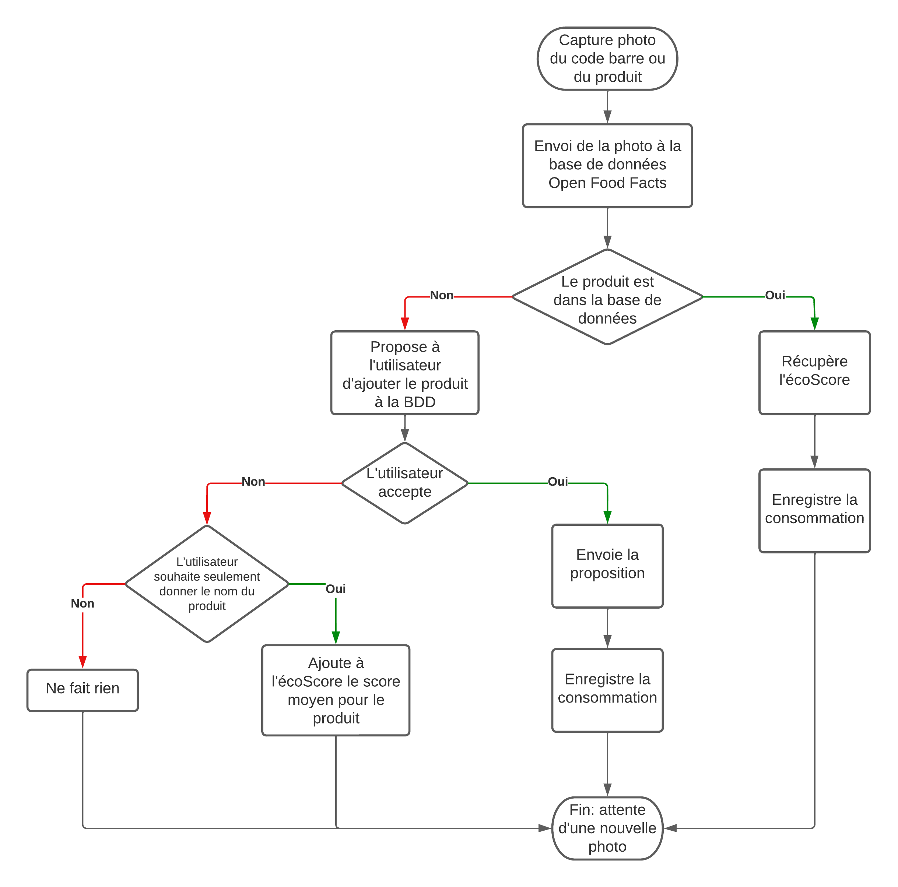
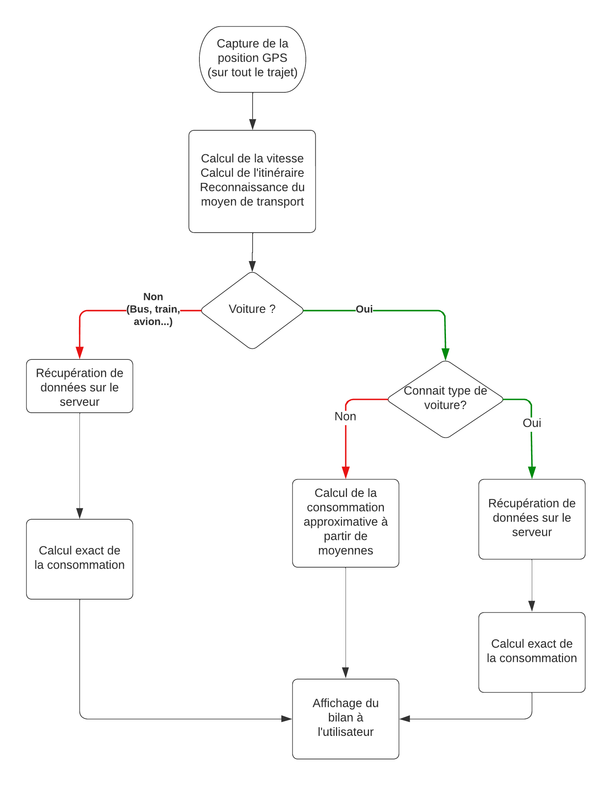

=== Diagramme de séquence (optionnel)

Lorsqu'un utilisateur scanne un produit, il n'est pas forcément dans la base de données OpenFoodFacts. Il faut donc s'adapter. De plus, on peut permettre à l'utilisateur d'enrichir la base de données.

Lorsque l'utilisateur se déplace, le téléphone va constamment enregistrer la position afin de déterminer la distance parcourue ainsi que la vitesse de l'utilisateur. Il enverra ensuite seulement ces données (donc pas la position précise pour des soucis de confidentialité) afin de connaître la consommation de l'utilisateur qui sera calculée sur le serveur.
